# Dentalk Club FMDC (DTC) — Master Concept, Governance & Event Ecosystem

---

## 📌 1. Executive Summary & Club Mission

**Dentalk Club FMDC (DTC)** is the premier student organization at the **Faculté de Médecine Dentaire de Casablanca (FMDC)** — *Université Hassan II de Casablanca (UH2C)*. Founded in **November 2024**, DTC bridges the gap between dental medical training and essential human leadership skills: public speaking, clinical debating, rhetorical eloquence, multidisciplinary dialogue, and digital media production.

* **Full Legal / Club Name:** Dentalk Club FMDC (DTC)
* **Founding Date:** November 2024
* **Parent Institution:** Faculté de Médecine Dentaire de Casablanca (FMDC), Université Hassan II de Casablanca (UH2C)
* **Official Motto:** *"Let your voice be heard with endless echoes."* 🎙️
* **Official Instagram:** [`@dentalkclub_fmdc`](https://www.instagram.com/dentalkclub_fmdc/)
* **Official Bio:** *Faculté de médecine dentaire de Casablanca · Club d'éloquence, débats et événements académiques*
* **Core Philosophy:** Transforming future dental surgeons into confident communicators, articulate leaders, and empathetic healthcare advocates.

---

## 🏛️ 2. Governance Hierarchy & Bureau Exécutif (Mandat 2025–2026)

The club is governed by a 12-member Executive Bureau elected to manage club operations, academic programs, multimedia productions, and linguistic debate sections.

### Organizational Chart (Mermaid Diagram)

```mermaid
graph TD
    %% Executive Leadership
    PRES["<b>El Guerraoui Hatim</b><br/>Président"]
    
    VP1["<b>EL Khabbouli Saad</b><br/>Vice-Président"]
    VP2["<b>Saber Maryam</b><br/>Vice-Présidente"]
    
    PRES --> VP1
    PRES --> VP2
    
    %% Core Administration
    SG["<b>Jei Aya</b><br/>Secrétaire Générale"]
    CP["<b>Abla Douaae</b><br/>Chef de Projet"]
    TR["<b>Ettallab Elhoussein</b><br/>Trésorier"]
    
    PRES --> SG
    PRES --> CP
    PRES --> TR
    
    %% Operational Directors & Department Heads
    DA["<b>Essaghir Anas</b><br/>Directeur Artistique"]
    RM["<b>El Kinani Yassir</b><br/>Responsable Média"]
    RL["<b>Mrabet Zyad</b><br/>Responsable Logistique"]
    
    PRES --> DA
    PRES --> RM
    PRES --> RL
    
    %% Linguistic Debate Sections
    SA["<b>Jawadi Salwa</b><br/>Responsable Section Anglaise (ANG)"]
    SF["<b>Rouadha Ihssane</b><br/>Responsable Section Française (FR)"]
    SAR["<b>Ouagague Hafsa</b><br/>Responsable Section Arabe (AR)"]
    
    PRES --> SA
    PRES --> SF
    PRES --> SAR
```

### Official Hierarchy Visual Asset
* **Asset Path:** [`instagram/team/bureau_executif_2025_2026.jpg`](../../instagram/team/bureau_executif_2025_2026.jpg)
* **Source Release:** Official announcement [Post DLDCuK1tg_i](https://www.instagram.com/p/DLDCuK1tg_i/)
* **Display Spec:** Integrated as a high-resolution interactive showcase visual on the `/about` page with responsive pan-and-zoom modal.

---

## 🏢 3. Functional Poles & Operations

1. **Pôle Présidence & Stratégie (Leadership & Relations Publiques)**
   - Oversees strategic vision, academic partnerships, faculty deanery relations, and inter-university collaborations.
   - Led by: **El Guerraoui Hatim** (Président), assisted by **EL Khabbouli Saad** & **Saber Maryam** (Vice-Présidents).

2. **Pôle Administration & Coordination Projets**
   - Coordinates event logistics, project timelines, sponsorship applications, and financial management.
   - Led by: **Jei Aya** (Secrétaire Générale), **Abla Douaae** (Chef de Projet), and **Ettallab Elhoussein** (Trésorier).

3. **Pôle Création, Médias & Identité Visuelle**
   - Designs official branding, digital graphics, photo shoots, and video production for YouTube and Instagram.
   - Led by: **Essaghir Anas** (Directeur Artistique) and **El Kinani Yassir** (Responsable Média).

4. **Pôle Logistique & Organisation Événementielle**
   - Coordinates amphitheater reservations, sound & lighting engineering, stage management, and tournament materials.
   - Led by: **Mrabet Zyad** (Responsable Logistique).

5. **Pôles Linguistiques & Débats (Sections Anglaise, Française, Arabe)**
   - Curates parliamentary debate motions, organizes weekly rhetoric workshops, and runs multilingual speaking competitions.
   - **Section Anglaise:** **Jawadi Salwa**
   - **Section Française:** **Rouadha Ihssane**
   - **Section Arabe:** **Ouagague Hafsa**

---

## 🎤 4. Flagship Initiative: TEDxFMDC (November 22, 2025)

**TEDxFMDC** is DTC's premier public-speaking event held at the main amphitheater of the Casablanca Dental Faculty, featuring 8 student speakers delivering high-impact talks across French, English, and Arabic.

### The 8 Official Speaker Talks & Video Reels Archive:
All 8 talk extracts are available as MP4 video reels in [`instagram/events/`](../../instagram/events) (talks 1–4 and 6–8 at 720x1280; talk 5 at 360x640):

| Extract | Speaker | Talk Subject & Core Theme | Video File (MP4) | Instagram Post Link |
| :---: | :--- | :--- | :--- | :--- |
| **1/8** | **Yahia Chemsi** | *"Les réseaux sociaux, l'intelligence artificielle et l'humain"* | `tedx_01_yahia_chemsi.mp4` | [DRsU8yIgBIp](https://www.instagram.com/p/DRsU8yIgBIp/) |
| **2/8** | **Aya Jei** | *"Brain rot : comprendre et surmonter l'hyper-stimulation numérique"* | `tedx_02_aya_jei.mp4` | [DRusITjjZg2](https://www.instagram.com/p/DRusITjjZg2/) |
| **3/8** | **Inès Ben Salah** | *"L'intelligence émotionnelle dans la pratique médicale"* | `tedx_03_ines_ben_salah.mp4` | [DRvCNV4AA-V](https://www.instagram.com/p/DRvCNV4AA-V/) |
| **4/8** | **Aya Talbi** | *"Zlayjiphobie : plaidoyer pour un patriotisme conscient"* | `tedx_04_aya_talbi.mp4` | [DRxngHcgGSG](https://www.instagram.com/p/DRxngHcgGSG/) |
| **5/8** | **Baha Eddine Achaach** | *"Gen Z : the pulse of a changing Morocco"* | `tedx_05_baha_eddine_achaach.mp4` | [DR2qD2mAMT8](https://www.instagram.com/p/DR2qD2mAMT8/) |
| **6/8** | **Hiba Birouki** | *"The cost of being flawless : déconstruire le perfectionnisme toxique"* | `tedx_06_hiba_birouki.mp4` | [DR5h9jODPEm](https://www.instagram.com/p/DR5h9jODPEm/) |
| **7/8** | **George Pupwe** | *"Redefining efficiency, beyond the perfect image"* | `tedx_07_george_pupwe.mp4` | [DSAuStRjSR8](https://www.instagram.com/p/DSAuStRjSR8/) |
| **8/8** | **Fahd Rahim** | *"Purpose over pressure : trouver sa vocation authentique"* | `tedx_08_fahd_rahim.mp4` | [DSBI9mogErJ](https://www.instagram.com/p/DSBI9mogErJ/) |

---

## 🎙️ 5. Let's Talk Podcast Series

Co-produced by **Dentalk Club FMDC** and **Club Social Dentaire (CSD)**, and officially sponsored by **Flex Dental**, *Let's Talk* is the flagship broadcast podcast featuring in-depth conversations with prominent dental surgeons, university professors, and healthcare pioneers.

* **Official Channel:** [`@LetsTalkPodcast-00`](https://www.youtube.com/@LetsTalkPodcast-00)
* **Episode 4 (Featured):** **Professeur Sidi Mohamed Bouzoubaa** — *Chirurgie, Pédagogie & Vision Médicale* (YouTube ID: [`FXTjMfmNmss`](https://www.youtube.com/watch?v=FXTjMfmNmss))
* **Episode 3:** **Professeure Sofia Haitami** — *Parcours Académique & Odontologie* (YouTube ID: [`JoMwnQbmKm0`](https://www.youtube.com/watch?v=JoMwnQbmKm0))
* **Episode 2:** **Professeur Amine Chafii** — *Excellence Pratique & Spécialisation* (YouTube ID: [`C1dKfXuC0us`](https://www.youtube.com/watch?v=C1dKfXuC0us))
* **Episode 1 (Inaugural Launch):** **Professeur Said Dhaimy** — *Épisode Inaugural & Endodontie* (Part 1: [`njrC04ZxJo0`](https://www.youtube.com/watch?v=njrC04ZxJo0), Part 2: [`dT1kpZzarEs`](https://www.youtube.com/watch?v=dT1kpZzarEs))
* **Behind-the-Scenes:** Studio production shots framing DSLR monitors and broadcast microphones ([`studio_bts_viewfinder.jpg`](../../instagram/podcasts/studio_bts_viewfinder.jpg)).

---

## 🏛️ 6. Debates, Eloquence & Continuous Training

* **Débats en Table Dentalk:** Structured head-to-head parliamentary debate tournaments where students debate bioethics, dental technologies, and healthcare policy.
* **Ateliers de Prise de Parole & Éloquence:** Regular interactive public speaking workshops in Salle Vésale covering non-verbal communication, voice modulation, rhetoric, and debate rebuttals.
* **Assemblées Générales & Mandate Galas:** Annual general assemblies for new student onboarding, mandate transitions, and club bonding retreats in Bouskoura forest.

---

## 🎨 7. Authentic Brand Identity & Design System

* **Authentic Official Logo:** High-resolution circular emblem extracted from the founding release ([Post DBMRjqrAGlM](https://www.instagram.com/p/DBMRjqrAGlM/)), saved at [`instagram/metadata/dtc_logo.png`](../../instagram/metadata/dtc_logo.png) (716x716 PNG).
* **Profile Avatar:** [`instagram/metadata/dtc_profile_avatar.jpg`](../../instagram/metadata/dtc_profile_avatar.jpg).
* **Color Hierarchy:**
  * **Midnight Navy (`#1B2E4B` / `#0B132B`):** Dominant dark canvas, conveying academic authority and prestige.
  * **Steel Blue (`#385A75` / `#2C4A63`):** Secondary container backgrounds and card trims.
  * **Prestige Gold (`#D4AF37` / `#F59E0B`):** Accent badges, trophy highlights, CTA borders, and glowing active states.
  * **Clinical Pure White (`#FFFFFF` / `#F8FAFC`):** Primary typography, tooth icon, and high-contrast clinical surfaces.
* **Typography:** Modern clean sans-serif pairing (`Inter` for body & clean data, `Plus Jakarta Sans` / `Outfit` for bold prestige headings).
