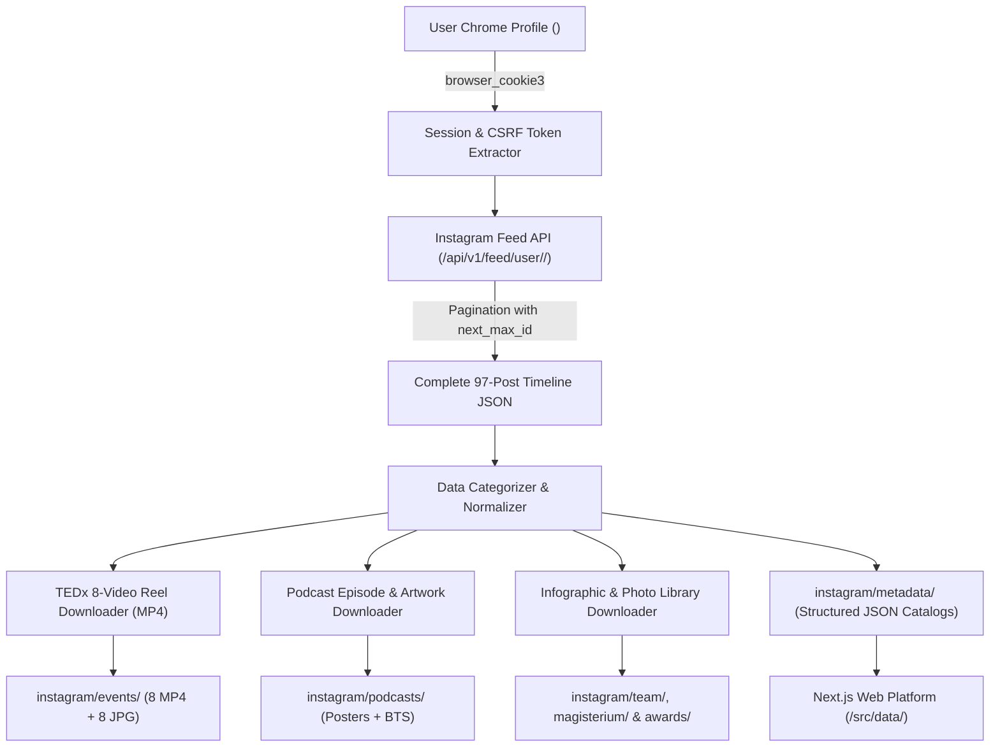

# Instagram Scraper & Synchronization Pipeline: Dentalk Club FMDC

This document details the scraper architecture, session extraction mechanics, timeline pagination protocol, and data schemas used to synchronize data from `@dentalkclub_fmdc`.

---

## 🛠️ 1. Architecture Overview



---

## 🔑 2. Authentication & Rate-Limit Bypassing

* **Mechanism:** Direct session extraction from Google Chrome using `browser_cookie3.chrome(domain_name="instagram.com")`.
* **Required Headers:**
  * `X-IG-App-ID: 936619743392459`
  * `X-Requested-With: XMLHttpRequest`
  * `X-CSRFToken: <extracted_csrf>`
  * `Cookie: sessionid=...; ds_user_id=<your_ds_user_id>; csrftoken=...`
  * `User-Agent: Mozilla/5.0 (Windows NT 10.0; Win64; x64) AppleWebKit/537.36`
* **Rate-Limit Management:**
  * Uses 1.5s polite sleep between paginated requests.
  * Captures `next_max_id` cursor to retrieve timeline in 12-item chunks until `more_available == False`.

---

## 📂 3. Utility Scripts Roster

All 12 pipeline scripts. The five **retired** scripts targeted the deleted `data/` working tree and are preserved for history under [`scripts/legacy/`](../../scripts/legacy).

### Active scripts (`scripts/`)

| Script | Purpose | Output Location |
| :--- | :--- | :--- |
| [`scripts/fetch_all_posts.py`](../../scripts/fetch_all_posts.py) | Paginate entire 97-post timeline via authenticated API | `instagram/metadata/all_posts_complete.json` |
| [`scripts/download_all_media.py`](../../scripts/download_all_media.py) | Download & structure all categorized media (TEDx posters, podcast artwork, team & awards photos) and emit typed catalogs | `instagram/events/`, `instagram/podcasts/`, `instagram/team/`, `instagram/awards/`, `instagram/metadata/tedx_talks.json`, `podcasts_catalog.json` |
| [`scripts/download_tedx_videos.py`](../../scripts/download_tedx_videos.py) | Extract and download all 8 TEDx MP4 video reels (7× 720x1280; talk #5 at 360x640) | `instagram/events/tedx_*.mp4` & `tedx_*.jpg` |
| [`scripts/extract_original_logo.py`](../../scripts/extract_original_logo.py) | Precision circle-crop authentic original DTC logo | `instagram/metadata/dtc_logo.png` (716x716) |
| [`scripts/crop_team_members.py`](../../scripts/crop_team_members.py) | Crop the 12 executive-board member tiles from the bureau infographic | `instagram/team/member_*.jpg` + team catalog JSON |
| [`scripts/generate_favicons.py`](../../scripts/generate_favicons.py) | Generate multi-resolution favicons, Apple touch icons & Next.js app icons from the authentic logo | `public/favicon.png`, `public/favicon.ico`, `public/apple-touch-icon.png`, `public/icon-512.png`, `src/app/*` icons |
| [`scripts/setup_public_assets.py`](../../scripts/setup_public_assets.py) | Copy logos & web-ready media into the static public tree | `public/logo.png`, `public/media/` |

### Retired legacy scripts (`scripts/legacy/`) — target the deleted `data/` tree

| Script | Original Purpose | Status |
| :--- | :--- | :--- |
| [`scripts/legacy/extract_instagram.py`](../../scripts/legacy/extract_instagram.py) | Instaloader profile scrape into `data/instagram/raw/` | Retired — `data/` deleted |
| [`scripts/legacy/parse_embed.py`](../../scripts/legacy/parse_embed.py) | Instagram embed-page HTML scraper writing `data/instagram/raw/embed_data.json` | Retired — `data/` deleted |
| [`scripts/legacy/download_and_organize.py`](../../scripts/legacy/download_and_organize.py) | Download & organize media from embed JSON into `data/instagram/organized/` | Retired — `data/` deleted |
| [`scripts/legacy/label_all_images.py`](../../scripts/legacy/label_all_images.py) | Semantic renaming & labeling into `data/instagram/labeled/` + catalog JSON | Retired — `data/` deleted |
| [`scripts/legacy/reorganize_instagram.py`](../../scripts/legacy/reorganize_instagram.py) | One-shot migration of labeled images into the root `instagram/` category folders | Retired — migration complete |

---

## 📋 4. JSON Data Schemas

### TEDx Talk Object (`tedx_talks.json`):
```json
{
  "extract": 2,
  "speaker": "Aya Jei",
  "topic": "Brain rot",
  "code": "DRusITjjZg2",
  "url": "https://www.instagram.com/p/DRusITjjZg2/",
  "video_file": "instagram/events/tedx_02_aya_jei.mp4",
  "poster_file": "instagram/events/tedx_02_aya_jei.jpg",
  "resolution": "720x1280",
  "size_mb": 13.7
}
```

### Podcast Episode Object (`podcasts_catalog.json`):
```json
{
  "code": "DXAEliYDW5w",
  "episode": 4,
  "guest": "Pr. Sidi Mohamed Bouzoubaa",
  "filename": "podcast_ep4_prof_bouzoubaa.jpg",
  "youtube_url": "https://www.youtube.com/watch?v=...",
  "sponsor": "Flex Dental",
  "partner": "Club Social Dentaire (CSD)"
}
```
