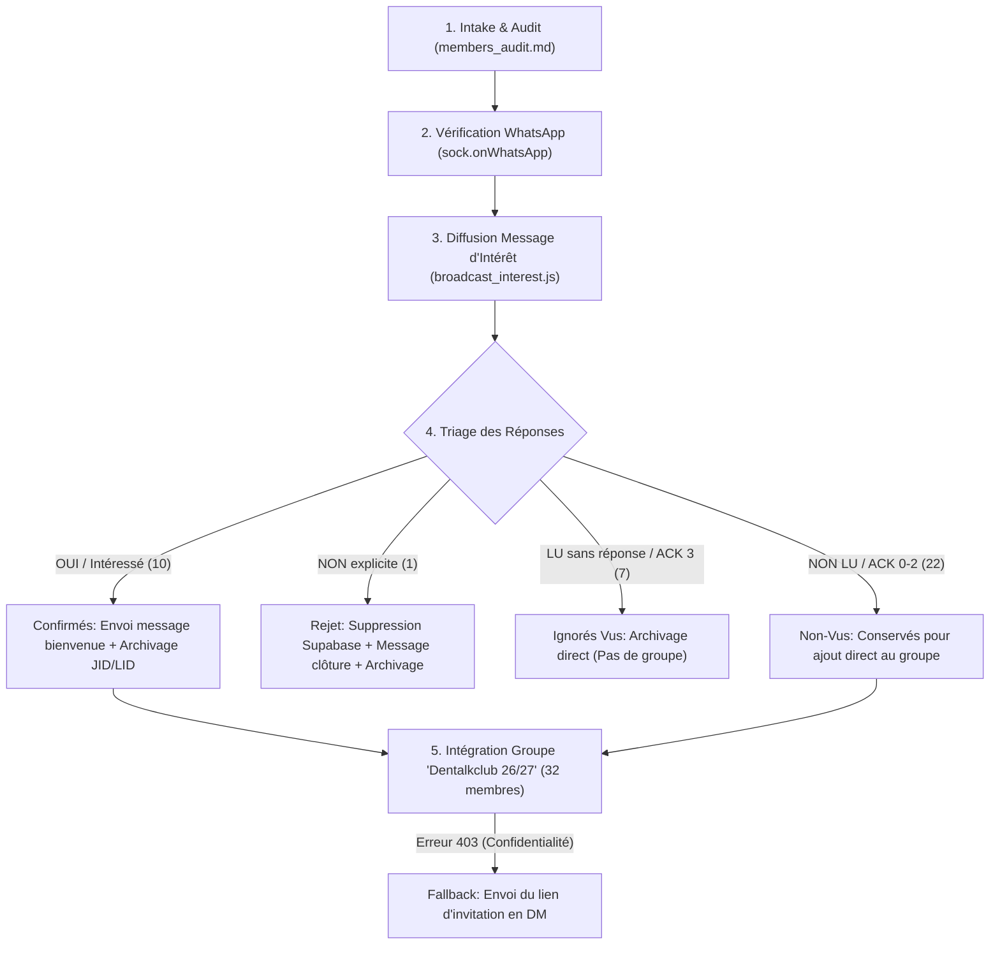

# DTC WhatsApp Automation & Recruitment SOP (Standard Operating Procedure)

Ce document consacre la procédure officielle, l'architecture isolée et les règles opérationnelles strictes pour toutes les opérations WhatsApp de **Dentalk Club (DTC)**.

---

## 1. Architecture & Isolation Absolue

### A. Séparation des Projets
- **/home/venus/Projects/Whatsapp Agent** : Agent universitaire FMDC 2A (`whatsapp-group-summarizer`, port 3000, mots-clés `2a chatgroup`). **NE JAMAIS TOUCHER NI DÉPENDRE DE CE PROJET.**
- **/home/venus/Projects/DTC** : Plateforme officielle Dentalk Club. Doit posséder son propre sous-système WhatsApp autonome ou pointer vers un dossier d'authentification strictement dédié (`whatsapp/auth_info/`).

### B. Configuration Technique du Socket Baileys
```javascript
import makeWASocket, { Browsers, useMultiFileAuthState } from '@whiskeysockets/baileys';

const AUTH_DIR = path.resolve(__dirname, 'auth_info'); // Isolée dans DTC
const { state, saveCreds } = await useMultiFileAuthState(AUTH_DIR);

const sock = makeWASocket({
  auth: state,
  browser: Browsers.ubuntu('Chrome'), // Obligatoire: évite le rejet de liaison WhatsApp
  syncFullHistory: false,             // Obligatoire: true provoque des désynchronisations Signal (Bad MAC)
  markOnlineOnConnect: false
});
```

---

## 2. Règles Opérationnelles Établies par le Président

1. **Permission Obligatoire** : Ne jamais ajouter de candidats à un groupe sans validation explicite du président.
2. **Test Préalable** : Tout message diffusé en masse doit être testé au préalable sur le numéro du président (`0635321003`).
3. **Approche Douce** : Le premier contact ne doit jamais présumer de l'adhésion ni envoyer de lien de groupe directement. Il demande si le candidat est toujours intéressé.
4. **Site Officiel** : L'URL du club est strictement **`https://dentalkclubfmdc.com`** (jamais `dtc-fmdc.com`).
5. **Archivage Double JID & LID** : Sur WhatsApp multi-device, l'archivage doit impérativement être appliqué sur le numéro (`@s.whatsapp.net`) **ET** sur le LID (`@lid`) avec le timestamp du dernier message.
6. **Anti-Ban** : Respecter un délai aléatoire (jitter) de 2.0s à 2.5s entre chaque message sortant. Ne jamais dépasser 50 envois par session.

---

## 3. Procédure Complète en 6 Étapes



---

### Étape 1 : Audit & Assainissement des Coordonnées
- Source : Fiches stand + Inscriptions site web QR code (`members_audit.md`).
- Normalisation : Format E.164 (`06XXXXXXXX` ➔ `2126XXXXXXXX`).
- Déduplication : Élimination des doublons de fiches.

### Étape 2 : Vérification de Compte WhatsApp
- Exécuter la vérification via l'API Baileys `sock.onWhatsApp(numbers)`.
- Si un numéro est inactif, tenter la correction croisée papier/site (ex: `0671642491` ➔ `0671649491`).
- Si toujours inactif, exclure du broadcast (ex: Idriss Essuidi `0657813459`).

### Étape 3 : Campagne de Prise de Contact
- Modèle validé à envoyer aux candidats :
```text
Bonjour {Prénom} ! 👋

Ici le bureau du Dentalk Club (DTC) — FMDC. 🦷

On a bien reçu tes coordonnées lors des inscriptions. On voulait vérifier avec toi : es-tu toujours intéressé(e) pour rejoindre le club cette année ?

Réponds simplement par un petit message pour nous confirmer.

Merci et bonne journée ! ✨
```
- Pacing : 2.2 secondes entre chaque envoi.

### Étape 4 : Règles de Triage des Réponses
| Catégorie | Critère | Action Immédiate |
|---|---|---|
| 🟢 **Confirmé (10)** | Réponse positive ("Oui", "Je confirme", "Intéressée", questions club) | 1. Envoyer message de bienvenue.<br>2. Conserver pour ajout groupe.<br>3. Archiver le chat (JID + LID). |
| 🔴 **Décliné (1)** | Refus explicite ("je ne pourrai pas...") | 1. Supprimer le compte et profil sur Supabase.<br>2. Envoyer message de clôture courtois.<br>3. Archiver le chat (JID + LID). |
| 👀 **Ignoré — Vu (7)** | Accusé bleu (`ACK=3`), aucun message en retour | 1. Ne pas relancer.<br>2. Archiver le chat (JID + LID).<br>3. **Ne pas ajouter au groupe.** |
| 📦 **Ignoré — Non-Vu (22)** | Message non ouvert (`ACK 0-2`, gris) | **Bénéfice du doute : Ajouter au groupe officiel.** |

### Étape 5 : Messages Types de Réponse

#### Pour les Confirmés :
```text
Super {Prénom}, c'est bien noté ! 🎉 Ton adhésion est confirmée, on t'ajoute au groupe officiel très bientôt pour démarrer les activités du club. Bienvenue dans la team DTC ! 🦷✨
```

#### Pour les Déclinés :
```text
Merci beaucoup pour ton retour {Prénom} ! Pas de souci du tout, on te souhaite une excellente rentrée et plein de succès pour cette année. À bientôt ! 🦷✨
```

### Étape 6 : Ajout au Groupe Officiel
- **Groupe cible officiel** : **`Dentalk Club 🦷`** (JID: `120363430121946139@g.us`, 8 admins bureau, le bot DTC est superadmin).
- **Lien d'invitation officiel** : `https://chat.whatsapp.com/Ewr17jiqmON1eD5QDWxXUN`.
- **Mécanisme d'ajout** :
  ```javascript
  const res = await sock.groupParticipantsUpdate(groupId, jids, 'add');
  ```
- **Gestion des erreurs de confidentialité (403)** :
  Si WhatsApp renvoie un statut `403` (l'utilisateur restreint les ajouts aux contacts), envoyer automatiquement en DM le lien d'invitation avec un message :
  > *"On a tenté de t'ajouter au groupe officiel Dentalk Club mais tes paramètres de confidentialité bloquent l'ajout direct. Voici ton lien d'invitation personnel pour nous rejoindre : https://chat.whatsapp.com/Ewr17jiqmON1eD5QDWxXUN"*

---

## 4. Roster Final Mis à Jour (40 Candidats)

### 🟢 23 Confirmés / Intéressés (Retenus pour ajout au groupe)
- **12 via réponse WhatsApp explicite** :
  1. Amrabt Ziad (`0628120962`) *(Déjà dans le groupe)*
  2. Btissam Aït Taleb (`0782106994`)
  3. Chaimae Chakmaoui (`0777679310`)
  4. Chaimae Saadi (`0693995935`)
  5. Eddahabi Mamoun (`0658923991`)
  6. Imane Ait Bella (`0679993251`)
  7. Malak Ettorky (`0680119150`)
  8. Othman Essaadi (`0620505972`)
  9. Sara Iguimer (`0656655636`)
  10. Yasser Essabar (`0671649491`)
  11. Zineb Saadi (`0714513193`)
  12. Zoumar Sara (`0619620602`)
- **11 non-vus validés via compte actif créé sur le site web DTC (Supabase)** :
  13. Anas Belhaiba (`0626675017`)
  14. Khouloud Sabour (`0724004003`)
  15. Luna Elkanouani (`0673714576`)
  16. Manal Aboutir (`0688614188`)
  17. Marwa Laanaya (`0658888473`)
  18. Oudouhou Ranya (`0676631847`)
  19. Said Salma (`0628347122`)
  20. Samia El Hiri (`0679472079`)
  21. Sara Elharradi (`0713578447`)
  22. Wijdane Aouzaï (`0698918431`)
  23. Yassine El Kamal (`0778833913`)

### ❓ 1 En Attente de Réponse (Question)
- **Amina Nejjarou** (`0718348865`) : Demande la date limite de confirmation.

### 🔴 2 Déclinés (Exclus & Traités)
- **Houda Rhiboul** (`0714172253`) : Compte Supabase supprimé, message de fin courtois envoyé.
- **Khadija Boussafar** (`0689563344`) : Refus explicite ("non je ne suis pas intéressé merci beaucoup ❤️").

### 🗑️ 8 Ignorés Vus (Supprimés de WhatsApp, Archivés dans le Projet)
- Al Batoul El Rhassir, Fadoua Moutayannice, Jalil Yasmine, Khaoula Nidbella, Lamkaidam Salma, Meryem Tarlamani, Nassima Elhor, Wissal Zakaria.
- Conversations WhatsApp supprimées (JID + LID) via `whatsapp/delete_and_archive_seen.js`. Données complètes archivées dans `whatsapp/data/archived_seen_no_replies.json`.

### 📦 6 Non-Vus Restants (Sans compte site web)
- Aya Hammouich (`0763487555`), Hiba Boutaqqa (`0604705975`), Ismail El Mhadi (`0780811806`), Kawtar Ait Hamou (`0774857903`), Sara Ammar (`0770417655`), Taoui Aya (`0612768096`).

---

## 5. Protocole Anti-Ban & Envoi de Masse à des Contacts Inconnus

Lorsque vous envoyez un message à quelqu'un qui **n'a pas enregistré votre numéro dans ses contacts**, WhatsApp affiche deux boutons critiques : **"Bloquer"** et **"Signaler comme spam"**. Si le taux de signalement dépasse ~1.5% à 2%, l'algorithme déclenche immédiatement une restriction temporaire de 24h ou un bannissement permanent.

### Les 6 Règles d'Or Anti-Ban
1. **Émulation de Présence Humaine (Presence Update)** :
   - Avant chaque message sortant, envoyer `sock.presenceSubscribe(jid)` puis `sock.sendPresenceUpdate('composing', jid)` pendant 2.0 à 4.0 secondes.
   - Les bots envoient sans statut "composing" ; les humains "tapent" avant d'envoyer.
2. **Jitter Aléatoire (Pacing Gaussien)** :
   - **Interdiction stricte des intervalles fixes** (ex: exactement 1s ou 2s).
   - Utiliser un délai aléatoire oscillant entre **12 secondes et 25 secondes** entre chaque destinataire.
3. **Plafond de Lot & Périodes de Repos** :
   - Maximum **20 à 25 messages par session/lot**.
   - Pause obligatoire de **10 à 15 minutes** avant de lancer le lot suivant.
4. **Variations Textuelles (Spintax & Variables Dynamiques)** :
   - Ne jamais envoyer une chaîne de texte identique à 40 numéros (même empreinte hash SHA-256).
   - Utiliser du Spintax : `{Bonjour|Salut|Hello} {Prénom}, {Ici le bureau|C'est l'équipe} DTC...`.
5. **Prévention du Signalement / Sortie Douce (Opt-Out Prompt)** :
   - Pour éviter que le destinataire clique sur le bouton rouge "Signaler Spam", lui offrir une alternative textuelle immédiate :
     > *"Si tu ne souhaites plus être contacté, réponds simplement NON."*
   - Un utilisateur qui tape "NON" génère un message entrant (bon signal de réputation) au lieu d'un signalement destructeur.
6. **Éviter les Liens et Réducteurs d'URL au 1er Message** :
   - Ne jamais inclure de liens (surtout bit.ly ou liens suspects) dans la toute première prise de contact non sollicitée.
   - Attendre que la personne réponde avant d'envoyer le lien de groupe ou le lien du site.

---

## 6. Architecture des Super-Pouvoirs de l'Agent DTC (`whatsapp/engine.js` & `cli.js`)

L'agent dispose désormais d'un contrôle total de type humain sur WhatsApp via `whatsapp/engine.js` :

### A. Écoute Bidirectionnelle Live (`whatsapp/listener.js`)
Le démon d'écoute tourne en tâche de fond permanente et surveille deux flux simultanément :
1. **Flux Candidats (`fromMe: false`)** : Détecte les messages entrants des candidats et met à jour leur fiche de réponse.
2. **Flux Président sur Téléphone (`fromMe: true`)** : **Détecte quand le président répond directement depuis son téléphone**, capture le texte, l'associe à l'historique du candidat et résout automatiquement les questions en attente (`has_question` ➔ `confirmed`).

### B. Commandes Directes en Ligne de Commande

| Catégorie | Commande | Description |
|---|---|---|
| **Roster & Statut** | `npm run wa:status` ou `node whatsapp/cli.js status` | Affiche l'état des 40 candidats, catégories et questions en attente. |
| **Ajout Groupe Sécurisé** | `npm run wa:add-confirmed` ou `node whatsapp/cli.js add-confirmed` | Ajoute les 23 confirmés au groupe `Dentalkclub 26/27` avec invitation privée si erreur 403. |
| **Répondre / Envoyer Texte** | `node whatsapp/cli.js reply <phone> "<texte>"` | Envoie avec simulation de frappe et met à jour automatiquement la classification. |
| **Envoyer Média** | `node whatsapp/cli.js send-media <phone> <fichier> ["<caption>"]` | Envoie image, vidéo, document PDF ou note vocale. |
| **Envoyer Contact** | `node whatsapp/cli.js send-contact <phone> "<Nom>" <numéro>` | Envoie une fiche contact vCard officielle. |
| **Réagir avec Émoji** | `node whatsapp/cli.js react <phone> <msgId> <émoji>` | Ajoute une réaction émoji sur un message spécifique. |
| **Gestion Groupe (Ajout/Suppression)** | `node whatsapp/cli.js group-add <groupId> <phone...>`<br>`node whatsapp/cli.js group-remove <groupId> <phone...>` | Ajoute ou retire des membres d'un groupe spécifique. |
| **Lien d'Invitation Groupe** | `node whatsapp/cli.js group-invite <groupId>` | Génère et affiche le lien d'invitation officiel d'un groupe. |
| **Infos Groupe** | `node whatsapp/cli.js group-info <groupId>` | Récupère le nom, le propriétaire, les membres et la description. |
| **Archivage / Suppression Chat** | `node whatsapp/cli.js chat-archive <phone>`<br>`node whatsapp/cli.js chat-delete <phone>` | Archive ou supprime un chat (JID + LID) sur WhatsApp. |
| **Vérification Numéro** | `node whatsapp/cli.js check-number <phone...>` | Vérifie si les numéros possèdent un compte WhatsApp actif. |
| **Informations Contact** | `node whatsapp/cli.js info <phone>` | Récupère la photo de profil et la bio/statut WhatsApp du numéro. |


